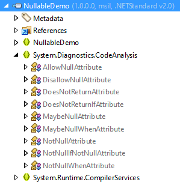
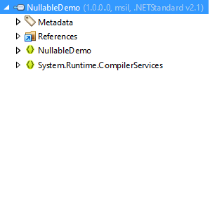

# Syntony.Common.Nullable [][NuGet Package]

_Use .NET Core 3.0's new nullable attributes in older target frameworks._

[**Quick Start Guide**](#quick-start-guide) &nbsp; | &nbsp; [**Guides**]() &nbsp; | &nbsp; [**NuGet Package**][NuGet Package]

## Prologue

This project (Syntony.Common.Nullable) was a fork of [Nullable](https://github.com/manuelroemer/Nullable). In fact the project Nullable is in the SDK format but the package creation is not in the SDK format and uses nuget.exe directly. This fork has just moved the NuGet part to the new SDK format. Moreover is the the unattractive and separate build process obsolete now. The project Syntony.Common.Nullable is in such a way designed to be includable by ProjectReference and is heavily used by Syntony.Common.Dotnet.

**When you face any issues with Syntony.Common.Nullable please do not open an issue in the repository of Nullable but open an issue [here](https://github.com/SyntonyAustria/Syntony.Common.Nullable/issues).**

## About Syntony.Common.Nullable

With the release of C# 8.0, support for [nullable reference types](https://docs.microsoft.com/en-us/dotnet/csharp/tutorials/nullable-reference-types)
has been added to the language.
Futhermore, .NET Core 3.0 added [new nullable attributes](https://docs.microsoft.com/en-us/dotnet/api/system.diagnostics.codeanalysis?view=netcore-3.0)
like the [`AllowNullAttribute`](https://docs.microsoft.com/en-us/dotnet/api/system.diagnostics.codeanalysis.allownullattribute?view=netcore-3.0)
which are sometimes required to exactly declare when and how `null` is allowed in specific code
sections.

Unfortunately, these attributes are not available in older target frameworks like .NET Standard 2.0
which makes annotating existing code harder.
Luckily, this problem can be solved by re-declaring the attributes as `internal class`es - the C#
compiler will still use them for generating warnings, even though the target framework doesn't
support these attributes by itself.

This repository hosts the code for the ["Syntony.Common.Nullable" NuGet Package][NuGet Package]
which, when referenced, adds support for these attributes.

The code for these attributes is added **at compile time** and gets **built into the referencing project**.
This means that the resulting project **does not have an explicit dependency** on the `Syntony.Common.Nullable`
package, because the attributes are not distributed as a library.

Futhermore, the code only gets added to the project if the nullable attributes are not already
supported by the target framework.
The images below show an example - in the library which targets .NET Standard 2.0, the attributes
have been added during the compilation.
That is not the case for the library targeting .NET Standard 2.1, because the attributes are
available through the .NET BCL there.
This allows you to easily **multi-target** your projects without having to change a single line of
code.

| .NET Standard 2.0 | .NET Standard 2.1 |
| ----------------- | ----------------- |
|  |  |

In C# 8.0 and later, the following attributes are used by the compiler for [null-state static analysis](https://learn.microsoft.com/en-us/dotnet/csharp/language-reference/attributes/nullable-analysis):

1. [**AllowNull**](https://learn.microsoft.com/en-us/dotnet/api/system.diagnostics.codeanalysis.allownullattribute): Pre-Condition: Specifies that null is allowed as an input even if the corresponding type disallows it.

2. [**DisallowNull**](https://learn.microsoft.com/en-us/dotnet/api/system.diagnostics.codeanalysis.disallownullattribute): Pre-Condition: Specifies that null is disallowed as an input even if the corresponding type allows it.

3. [**MaybeNull**](https://learn.microsoft.com/en-us/dotnet/api/system.diagnostics.codeanalysis.maybenullattribute): Post-Condition: Specifies that null might be returned even if the corresponding type disallows it.

4. [**NotNull**](https://learn.microsoft.com/en-us/dotnet/api/system.diagnostics.codeanalysis.notnullattribute): Post-Condition: Specifies that null will never be returned even if the corresponding type allows it.

5. [**MaybeNullWhen(bool)**](https://learn.microsoft.com/en-us/dotnet/api/system.diagnostics.codeanalysis.maybenullwhenattribute): conditional Post-Condition: Specifies that an output may be null when the result of the method is the specified boolean value.

6. [**NotNullWhen(bool)**](https://learn.microsoft.com/en-us/dotnet/api/system.diagnostics.codeanalysis.notnullwhenattribute): conditional Post-Condition: Specifies that an output is not null when the result of the method is the specified boolean value.

7. [**NotNullIfNotNull(string)**](https://learn.microsoft.com/en-us/dotnet/api/system.diagnostics.codeanalysis.notnullifnotnullattribute): conditional Post-Condition: Specifies that the output will be not null if the named parameter is not null.

8. [**DoesNotReturn**](https://learn.microsoft.com/en-us/dotnet/api/system.diagnostics.codeanalysis.doesnotreturnattribute): Specifies that a method will never return. Stop nullable analysis when called method throws.

9. [**DoesNotReturnIf(bool)**](https://learn.microsoft.com/en-us/dotnet/api/system.diagnostics.codeanalysis.doesnotreturnifattribute): Specifies that the method will not return if the associated Boolean parameter is passed the specified value. May throw an exception based on the value of a Boolean argument

10. [**MemberNotNull(string)**](https://learn.microsoft.com/en-us/dotnet/api/system.diagnostics.codeanalysis.membernotnullattribute): Helper method: Specifies that the specified member of the containing type will not be null after the method call, if it successfully completes.

11. [**MemberNotNullWhen(bool, string)**](https://learn.microsoft.com/en-us/dotnet/api/system.diagnostics.codeanalysis.membernotnullwhenattribute): Helper method: Specifies that the specified member of the containing type will not be null when the method returns the specified boolean value.These attributes are part of the System.Diagnostics.CodeAnalysis namespace. They are used to annotate your code and inform the compiler about the nullability contract of your code, which helps the compiler provide better warnings and errors about potential null reference exceptions.


## Compatibility

Nullabe is currently compatible with the following target frameworks:

* .NET Standard >= 1.0
* .NET Framework >= 2.0

Please have a look at the [guides](https://github.com/SyntonyAustria/Syntony.Common.Nullable) for additional information on how to
install the package for your target framework.


## Quick Start Guide

> :warning: **Important:** <br/>
> You **must** use a C# version >= 8.0 with the `Syntony.Common.Nullable` package - otherwise, your project won't compile.

The steps below assume that you are using the **new SDK `.csproj`** style.
Please find installation guides and notes for other project types (for example `packages.config`)
[here](https://github.com/SyntonyAustria/Syntony.Common.Nullable).

1. **Reference the package** <br/>
   Add the package to your project, for example via:

   ```sh
   Install-Package Syntony.Common.Nullable

   --or--

   dotnet add package Syntony.Common.Nullable
   ```
2. **Ensure that the package has been added as a development dependency** <br/>
   Open your `.csproj` file and ensure that the new package reference looks similar to this:

   ```xml
   <PackageReference Include="Syntony.Common.Nullable" Version="<YOUR_VERSION>">
     <PrivateAssets>all</PrivateAssets>
     <IncludeAssets>runtime; build; native; contentfiles; analyzers; buildtransitive</IncludeAssets>
   </PackageReference>

   <!-- This style also works, but is not automatically used by .NET: -->
   <PackageReference Include="Syntony.Common.Nullable" Version="<YOUR_VERSION>" PrivateAssets="all" />
   ```

   This is especially important for libraries that are published to NuGet, because without this,
   the library will have an **explicit dependency** on the `Nullable` package.
3. **Build the project** <br/>
   Ensure that the project compiles. If a build error occurs, you will most likely have to update
   the C# language version (see next step).
4. **Enable usage of the attributes** <br/>
   Still in your `.csproj` file you need to activate the feature to fully use it.
   The following activation sample is what seems to be the most common use case. But do not hesitate to look at my [guides](https://github.com/SyntonyAustria/Syntony.Common.Nullable) for other considerations.

   ```xml
   <PropertyGroup>
      <!-- a sample list of target frameworks including legacy ones. This list must depend on your needs. -->
     <TargetFrameworks>net472;netstandard2.0;netstandard2.1;netcoreapp3.0</TargetFrameworks>
     <!-- force lang version at least to C#8 to be able to use the feature with all frameworks.-->
     <LangVersion>8.0</LangVersion> <!-- or --> <LangVersion>latest</LangVersion>
     <!-- enable the feature but without warning for legacy frameworks to avoid false positives. -->
     <Nullable>annotations</Nullable>
     <!-- enable the feature including warnings only on top of the most recent framework you target. -->
     <!-- it will serve as a reference for warnings for all others. -->
     <Nullable Condition="'$(TargetFramework)' == 'netcoreapp3.0'">enable</Nullable>
   </PropertyGroup>
   ```

5. **Build the project and fix warnings** <br/>
   If you're not starting a new project you will probably get a lot of warnings now, since your code base is not yet annotated.
   If you don't expect to fix all right now, one solution could be to disable the feature in all files before reviewing each file one by one.
   For that run the following powershell script to add a `#nullable disable` directive at the top of each file.

   ```PowerShell
   Get-ChildItem -Recurse -Filter *.cs | ForEach-Object {
     "#nullable disable`n" + (Get-Content $_ -Raw) | Set-Content $_
   }
   ```

You should now be ready to play with nullable references and the attributes even when targeting legacy frameworks.


## Compiler Constants

The [included C# files](src/)
makes use of some compiler constants that can be used to enable or disable certain features.

### `NULLABLE_ATTRIBUTES_DISABLE`

If the `NULLABLE_ATTRIBUTES_DISABLE` constant is defined, the attributes are excluded from the build.
This can be used to conditionally exclude the attributes from the build if they are not required.

In most cases, this should not be required, because the package automatically excludes the attributes
from target frameworks that already support these attributes.


### `NULLABLE_ATTRIBUTES_INCLUDE_IN_CODE_COVERAGE`

Because the attributes are added as source code, they could appear in code coverage reports.
By default, this is disabled via the [`ExcludeFromCodeCoverage`](https://docs.microsoft.com/en-us/dotnet/api/system.diagnostics.codeanalysis.excludefromcodecoverageattribute?view=netcore-3.0)
and [`DebuggerNonUserCode`](https://docs.microsoft.com/en-us/dotnet/api/system.diagnostics.debuggernonusercodeattribute?view=netcore-3.0)
attributes.

By defining the `NULLABLE_ATTRIBUTES_INCLUDE_IN_CODE_COVERAGE` constant, the [`ExcludeFromCodeCoverage`](https://docs.microsoft.com/en-us/dotnet/api/system.diagnostics.codeanalysis.excludefromcodecoverageattribute?view=netcore-3.0)
and [`DebuggerNonUserCode`](https://docs.microsoft.com/en-us/dotnet/api/system.diagnostics.debuggernonusercodeattribute?view=netcore-3.0)
attributes are not applied and the nullable attributes may therefore appear in code coverage reports.


## Building

No outer build process needed, just run:

```
dotnet build Syntony.Common.Nullable.csproj
```

The MSBuild-target **CopyToStaticAnalyseAttributeCSPPFilesFolder** is running before MSBuild-target `AddStaticAnalyseAttributesCSPPFilesToPackage` and copies the .cs-files to folder `obj/StaticAnalysisAttributes` with new extension ".cs.pp".

The MSBuild-target **AddStaticAnalyseAttributesCSPPFilesToPackage** is running before `Pack` and adds dependent on framework the necessary files in their respective framework folders; once for folder content (package) and once for folder contentFiles (package).

## Contributing

As the Author of [Nullable][Nullable] stated, the source files itself won't change much, when ever, but when you have ideas, features or bug fixes, feel free to send me a pull request.

## License

The original project is licensed under the MIT license, this won't change. See updated [LICENSE](LICENSE) file for details.

[Nullable]: https://github.com/manuelroemer/Nullable
[NuGet Package]: https://www.nuget.org/packages/Syntony.Common.Nullable
